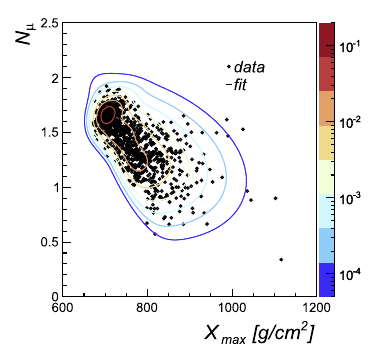

<p align="left">
  
</p>

# mst-mix-fitter
A C++ software tool for fitting mixtures of multivariate skew-t distributions to data. It is distributed for research use only under the GNU General Public License v3.0.

## **Credits**
If you use this software for your research, please acknowledge it in your papers by citing the following references:

* `S. Riggi, S. Ingrassia, "A model-based clustering approach for mass composition analysis of high energy cosmic rays", Astroparticle Physics 48 (2013) 86–96`

or consider including me (`S. Riggi, INAF - Osservatorio Astrofisico di Catania, Via S. Sofia 78, I-95123, Catania, Italy`)
as a co-author on your publications.

## **Status**
Software is currently been updated.

## **Installation**  

### **Prerequisites**
Install the project mandatory dependencies:  
* ROOT [https://root.cern.ch/]
* R [https://www.r-project.org/], install also these additional packages: RInside, Rcpp, Matrix, moments, flexclust
* log4cxx [https://logging.apache.org/log4cxx/]
* boost [http://www.boost.org/]

Make sure you have set the following environment variables to the external library installation dirs 
* ROOTSYS: set to ROOT installation path
* LOG4CXX_DIR: set to LOG4CXX library installation path
* BOOST_ROOT: set to BOOST library installation path

NB: Modify Makefile CPPFLAGS and LDFLAGS in case the dependency tools cannot be found.

### **Build**
To build the project:

* Clone this repository into your local $SOURCE_DIR    
  ```git clone https://github.com/simoneriggi/mst-mix-fitter.git $SOURCE_DIR```    
* In the project directory type:    
  ```make```  

Binaries will be placed in the bin/ directory and libraries in the lib/ directory.

### **Usage**
* ```MSTMixtureFitter --config=[path-to-configfile]```    
&nbsp;&nbsp;&nbsp;&nbsp;&nbsp;&nbsp;&nbsp;```--config=[path-to-configfile] - Configuration file name with options```    
